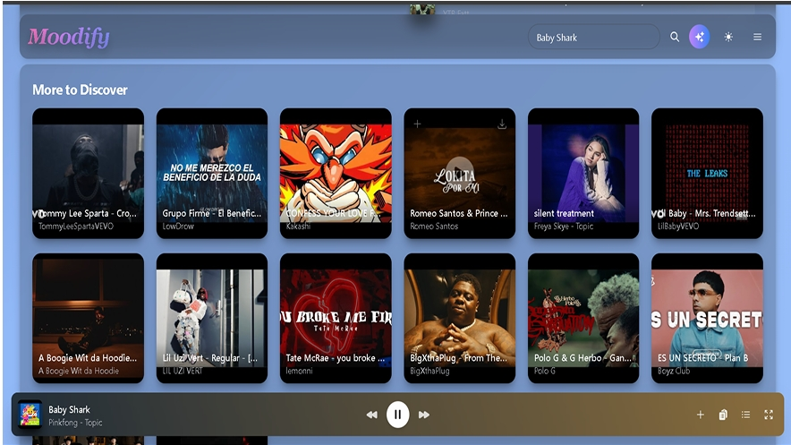
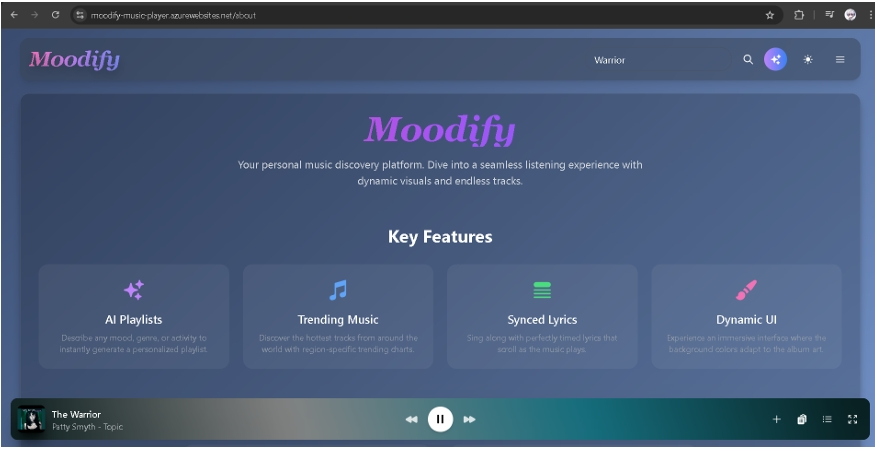
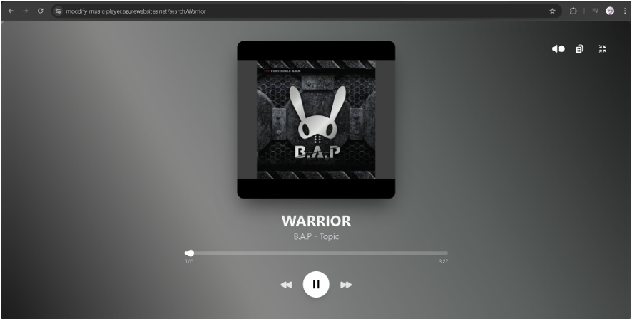

# Moodify

> A mood-first music discovery and playback experience built for finding the right soundtrack for every moment.

<p align="center">
	
</p>

Moodify combines regional music trends, search, mood-based playlist generation, synchronized lyrics, and a persistent YouTube-powered player in one focused interface. It is designed to make music discovery feel personal without getting in the way of listening.

## Highlights

- **Discover music** through regional YouTube trends and search results.
- **Generate playlists by mood** with the OpenAI-powered playlist assistant.
- **Listen with context** using synchronized lyrics from LRCLIB and a full now-playing view.
- **Build a personal library** with saved playlists, recently played tracks, and search history.
- **Keep playback close** with queue controls, previous/next navigation, volume, downloads, and Media Session support.
- **Sign in securely** with Google OAuth to sync personal data through MongoDB.
- **Adapt to your setup** with light/dark themes, responsive layouts, and dynamic album-art backgrounds.

## Screenshots

| Home and discovery | Feature overview |
| --- | --- |
|  |  |

<p align="center">
	
</p>

## Tech Stack

**Frontend**

- React 19 with TypeScript
- Vite
- React Router
- Tailwind CSS
- Heroicons and AOS
- YouTube IFrame Player API

**Backend**

- Node.js and Express
- MongoDB with Mongoose
- Passport Google OAuth 2.0
- YouTube Data API
- OpenAI playlist generation
- LRCLIB lyrics API

## Project Structure

```text
Moodify/
├── src/                 # React application, pages, components, and state
├── public/              # Static frontend assets
├── backend/             # Express API, authentication, and MongoDB models
├── screenshot/          # Product screenshots used in this README
├── package.json         # Frontend scripts and dependencies
└── vite.config.ts       # Vite configuration
```

## Getting Started

### Prerequisites

- Node.js 18 or newer
- A MongoDB database
- YouTube Data API key
- Google OAuth 2.0 credentials
- OpenAI API key for mood playlist generation

### 1. Install dependencies

```bash
npm install
cd backend
npm install
cd ..
```

### 2. Configure the backend

Create `backend/.env`:

```env
PORT=3001
NODE_ENV=development
MONGO_URI=your_mongodb_connection_string
SESSION_SECRET=replace_with_a_long_random_value
YOUTUBE_API_KEY=your_youtube_data_api_key
OPENAI_API_KEY=your_openai_api_key
GOOGLE_CLIENT_ID=your_google_client_id
GOOGLE_CLIENT_SECRET=your_google_client_secret
FRONTEND_URL=http://localhost:5173
BACKEND_URL=http://localhost:3001
```

For Google OAuth, add `http://localhost:3001/auth/google/callback` as an authorized redirect URI in your Google Cloud project.

### 3. Configure the frontend

Create `.env` in the project root:

```env
VITE_API_BASE_URL=http://localhost:3001
```

### 4. Run Moodify

Start the API in one terminal:

```bash
cd backend
npm start
```

Start the frontend in another:

```bash
npm run dev
```

Open the local URL printed by Vite, usually `http://localhost:5173`.

## Available Scripts

From the project root:

| Command | Description |
| --- | --- |
| `npm run dev` | Start the Vite development server |
| `npm run build` | Type-check and create a production build |
| `npm run lint` | Run ESLint |
| `npm run preview` | Preview the production build locally |

From `backend/`:

| Command | Description |
| --- | --- |
| `npm start` | Start the Express API server |

## Deployment Notes

Build the frontend with `npm run build` and deploy the generated `dist/` directory to your static hosting provider. Deploy the `backend/` service separately, set the same environment variables in production, and update `FRONTEND_URL`, `BACKEND_URL`, the Google OAuth callback, and CORS configuration for the deployed domains.

## License

This project is distributed under the license in [LICENSE](LICENSE).
